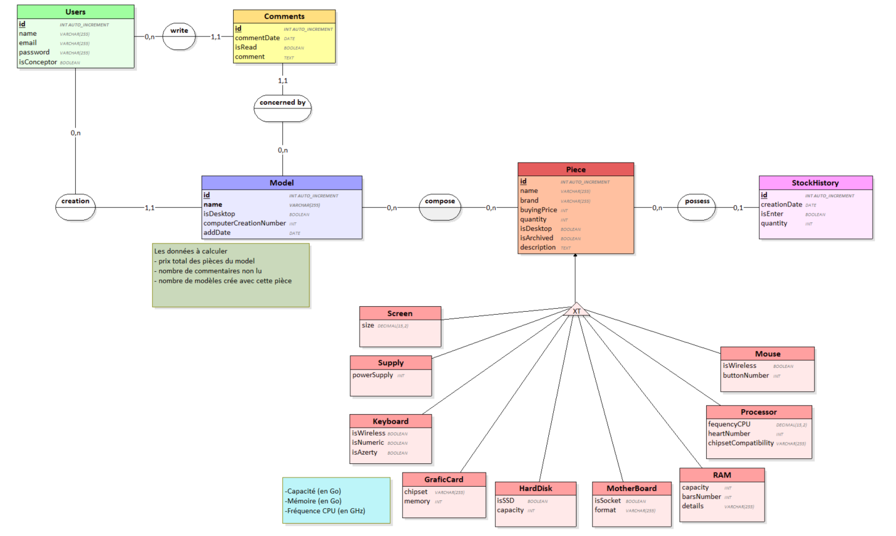

# Projet-montage-ordinateur

Vous trouverez dans la dossier [ressources](./ressources/) : 
 - Un export de la BdD vide [computer_assembly.sql](./ressources/computer_assembly.sql)
 - Le PDF de notre schéma MCD de la BdD
 - Le fichier Looping de notre shéma BdD

[Lancer les fixtures ici](http://localhost/Projet-montage-ordinateur/fixtures/fixtures.php)

<h3>Notre MCD :</h3>

